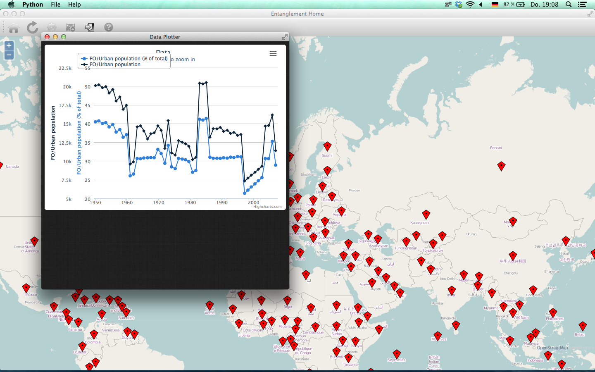

Detanglement
============


This repo contains a research project I work on at FKI/HTW Berlin.
As with most of my repositories, this is a work-in-progress, more specifically,
an alpha.

It is a tool that visualizes big amounts of geolocalized data on-demand.
At the moment, only a proof-of-concept plugin for WorldBanks' Indicator API
is working with it, but it can theoretically be extended to work with many
different APIs; that is the goal, anyway.

Table of Contents
-----------------
1. **[Requirements](#requirements)**
2. **[Usage](#usage)**
3. **[Writing Plugins](#writing-plugins)**
4. **[Contribute](#contribute)**

Requirements
------------

The tool requires a few additional python libraries to work, namely:

```
PyQt5
pygeoip
geopy
```

Additionally, if you want the WorldBank plugin to work(which is the
only working plugin right now, so you might), you need to install
`wbpy`.
Also, if you want to check out the nonworking plugin for Twitter(which
adds markers to the map, but the data is not visualized), you need
to install `TwitterAPI`.

I have included all Javascript APIs you might need, hoping that no
licensing issues will emerge.

Usage
-----

There are many ways to invoke/use the application. I suggest you `git clone`
the repository first, change into the `src`directory and check out the 
command-line features(by invoking `./Tangle.py -h`). To wrap up what I 
just told you, it should look like this:

```bash
git clone https://github.com/hellerve/Detanglement.git
cd Detanglement/src
./Tangle.py -h
```

After you have made yourself familiar with the main scripts' features, you 
can explore the tool by typing:

```bash
./Tangle.py -f
./Tangle.py -a WorldBank
```

Which loads the script with WorldBanks' Indicator API and shows the tools
capabilities pretty well. Click around, make yourself at home.


Sooner or later you will want to visualize something, because, you know,
that is what the tool is about. You can click any marker; a window will pop
open and ask you to apply filters. 


Certain filters will not be available for certain
areas, but you will see that by experimenting. Other filters(like `Population
(Total)`) will almost always be available. You can fiddle around, search them
by the search bar or by hand(but that might be pretty unconformtable, because
WorldBank provides well over 9000(no pun intended) filters. You can also supply it
regular expressions. If those are not valid, it will try to search it literally.


Sooner or later you will find the filters you want to apply: Dragging them into
the second(empty) list will select them and if you click apply, a different window
should open and visualize the filters for you - except if you get a notification that
the filter did not provide any data.



If you click the settings icon(the little cogwheel in the toolbar), you will also
have the possibility to select an alternative map(Kartograph is not working right now,
because it is based on Python 2.7 and we are using Python 3+, but we are working
on that). You can also toggle geolocation and APIs, although the API section should look
a bit... empty.


Writing Plugins
---------------

You have your own API that you want to visualize or want to contribute? Good for you!
With the plugin system, it should be fairly easy.

**What your data needs to be***

In order for me to be able to visualize your data, it must be geolocalized and
have some sort of timeline. If your data does not meet these criteria, I fear this
tool is not for you; at least not yet.

**What your plugin needs to have**

Your plugin needs to have a single file that needs to be called from outside,
with a single class(there can be more, but I need that one class) in it that 
needs to meet the following criteria:

    1. The constructor is either called without arguments or with the API
       keys as arguments.
    2. There is a public(no underscore) variable of type bool named 
       `requiresFilter` which is either set to true(the API needs filters) or
       false(it does not).
    3. There is a public method named `getLocations()` that takes no arguments
       and returns a list of locations. Locations can either be country names
       or city names.
    4. If the API requires a Filter(`requiresFilter = True`), there must be a
       method named `getFilters()` that returns a list of human-readable filters.
    5. There is a public method named `getDataForLocation()` that takes a location,
       a filter(both in the format provided by `getLocations()` and `getFilters()`
       respectively) and a time range(two values in a single string seperated by commas,
       e.g. "2010:2012" for a timeline from 2010 until 2012(both years included)).

If you are able to provide those features, you are ready to try them out. The easiest way
is to provide the needed API keys and the API name to Detanglement via the database 
window(the dotted rectangle in the iconed bar of the main window) and then restart it.


To be completely sure that the API will be loaded, you can run `Tangle.py -a MyApiName`
which will load your API if possible. If not, nothing will be loaded.

More coming soon.

Contribute
----------

What needs to be done? Well, many things. I documented most of the bugs in a file
in `rc` called `KNOWN_BUGS`. You can add to it or open an issue. There is also file
in the directory called `PLANNED_FEATURES`, documenting what needs to be done.
You can also look at both files by invoking `./Tangle.py -d` or `./Tangle.py --devel`
or, if you have installed it (kudos, you are likely to use Linux, because it is a pain
to install it on any other platform at the moment) `Tangle -d`.

I am currently working on making the whole application a web app. I am using Django
for that.

Also, the help file is a mess that needs to be cleaned up by someone who enjoys writing
HTML files more than me. It is a non-informative mess.

I suggest you code a plugin and see if it works. If it does not, we can look at what is
the problem and fix it together.

Technical Rant
--------------

This section makes understanding the code much easier. It must not be read; however,
if you plan on contributing to this software, you might as well spend some time on
learning the philosophy behind it.

I chose python for the job, because everything in Python is an object and I can theoretically
apply category theory to it to transform any type of data you provide into a plottable,
quantifiable set. The problem with that approach is the (admittedly very hard) problem of
identifying the incoming data and what the significant bits to plot are. This is where
philosophy comes in; one might not always get the output he expected or hoped for because
the program applied the wrong filters. The basic problem boils down to this: identify the
set, transform it, quantify it, plot it. The master branch of this program has only very basic 
capabilities in identifiying the data and does not filter much of it. I am working on a more
sophisticated mechanism that does the job, but it is very unstable, unreliable and not very 
sharable at the moment, so if you wish to extend the project, keep in mind that this is only
a rough sketch of what I wish to be possible.

I tried to keep this intro as brief and high level as possible. If you have, questions, 
suggestions or anything you want to talk to me about it, feel free to contact me.
